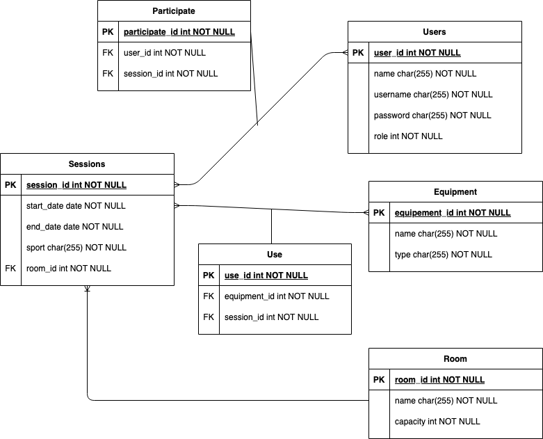

# session_organizer
Web application to organize gym sessions.

## Funkcionális követelmények

TODO

## Nem funkcionális követelmények

* használhatóság (Felhasználóbarát, ergonomikus elrendezés és kinézet)
* megbizhatóság (Biztonságos működés: jelszavak tárolása, funkciókhoz való hozzáférés.)
* hordozhatóság
* hatékonyság

## Adatbázis

<h2 align="center">

</h2>

## Szerepkörök

* vendég:
* felhasználó:
* felhasználó:
* admin:

## Kliensoldali szolgáltatások

* Bejelentkezés/kijelentkezés 